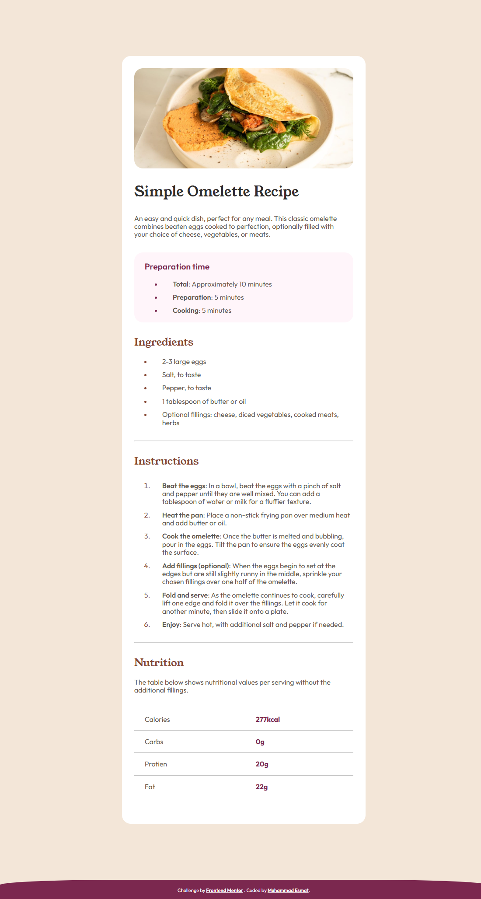
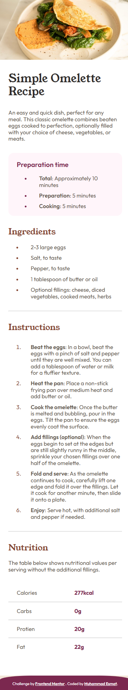

# Frontend Mentor - Recipe page solution

This is a solution to the [Recipe page challenge on Frontend Mentor](https://www.frontendmentor.io/challenges/recipe-page-KiTsR8QQKm). Frontend Mentor challenges help you improve your coding skills by building realistic projects.

## Table of contents

- [Overview](#overview)
  - [Screenshot](#screenshot)
  - [Links](#links)
- [My process](#my-process)
  - [Built with](#built-with)
  - [What I learned](#what-i-learned)
  - [Continued development](#continued-development)
  - [Useful resources](#useful-resources)
  - [AI Collaboration](#ai-collaboration)
- [Author](#author)
- [Acknowledgments](#acknowledgments)

## Overview

### Screenshot

  
  

### Links

- Live Site URL: [https://omlette-page.netlify.app/](https://omlette-page.netlify.app/)

## My process

### Built with

- Semantic HTML5 markup
- CSS custom properties
- Flexbox
- `@font-face` for custom fonts

### What I learned

- Loading local fonts using `@font-face` and self-hosted fonts and webfonts from providers like Google Fonts.
- Deeper understanding of `<table>` styling and styling lists (`<ul>`/`<ol>`) and list markers
- How to effectively use a style guide (colors, typography) to match a design

### Continued development

I want to build more projects to solidify my HTML and CSS foundations before moving on to more advanced topics.

### Useful resources

- [Stack Overflow](https://stackoverflow.com/) & Google — for troubleshooting specific issues
- AI assistant — used as a mentor to explain concepts needed to complete the project 

### AI Collaboration

I used AI (via opencode) as an assistant in this project. It acted as a mentoring guide — I asked for explanations, and help structuring this README. It never wrote code for me directly; instead it helped me to figure things out myself.

## Author

- GitHub - [@muhammad-esmat](https://github.com/muhammad-esmat/)
- LinkedIn - [Muhammad Esmat](https://www.linkedin.com/in/muhammad-esmat-947355387/)
- Frontend Mentor - [@muhammad-esmat](https://www.frontendmentor.io/profile/muhammad-esmat)

## Acknowledgments

- **Frontend Mentor** — for providing such well-crafted challenges and the style guide, assets, and design files
- **Osama Elzero** — Truly grateful for the great passion you put into your teaching and for making everything click so naturally.
